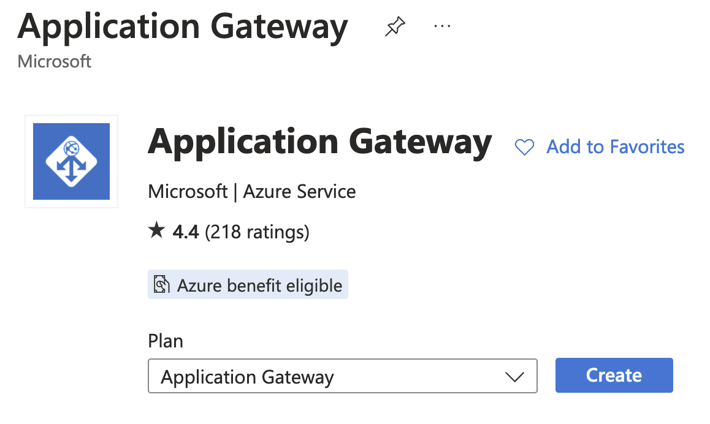
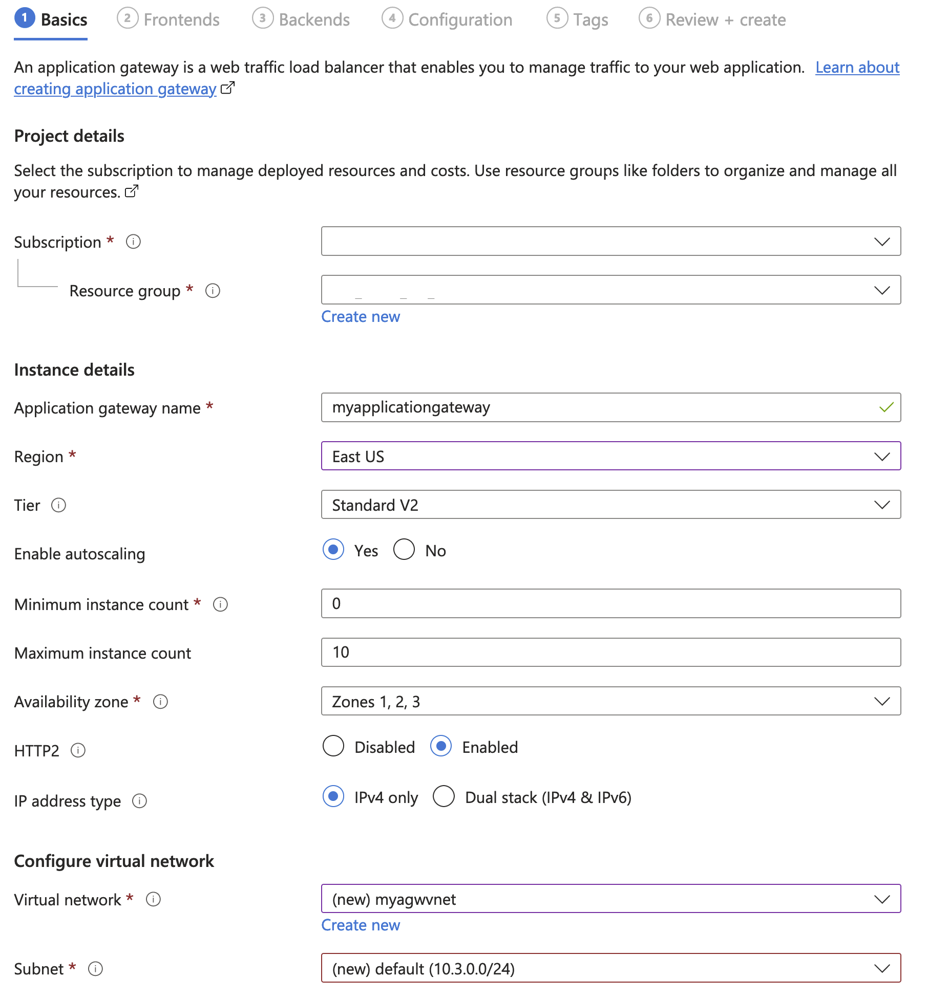
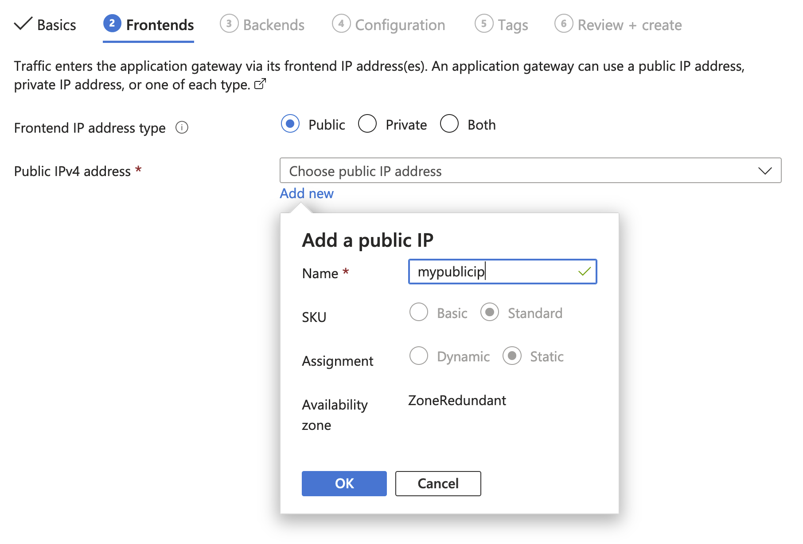

# openshift-multicluster-azure-load-balancing

How to set up a multi-cluster environment using Azure Application Gateway

## Use case

Say that you have set up an ARO cluster with several applications running on it. It's all working well but you'd like to make sure that under no circumstances do these applications ever stop working for your customers, so you decide to set up an active-active disaster recovery setup by spinning up another ARO cluster. A few issues now need to be addressed.

- How would you balance the incoming HTTPS user requests?
- How can I easily set up the certificates for my domain so I don't have 20 replicas everywhere?


## Setup

### Prerequisites

- Two or more clusters (technically you could do this for a single cluster if you want to have a WAF installed in front of it). These cluster can be ARO clusters or anything else!
- An Azure account that can request a new [Azure Application Gateway](https://learn.microsoft.com/en-us/azure/application-gateway/overview).
- About 20 minutes of your time

### Step 1) Ensure your apps are accesible from outside the cluster

Be it a private or public cluster setup, ensure the Application Gateway we are about to create has access to the applications. For this example let's balance two "Hello Openshift" applications. Log in to your cluster and create the deployment.

#### Setup Cluster A, app2

> [!tip]
> Some of these commands take a bit to complete in the background, despite the terminal returning everything is OK. Consider cheching before pasting the next command.
>
> Bear in mind that this is a simple tutorial, in a real life scenario we would be better off using a declarative approach to Kubernetes.

```bash
export CLUSTER="clusterA"
export APP="app1"
# Create a project for the app
oc new-project $APP
# Deploy the application on said namespace
oc create deploy $APP --image=openshift/hello-openshift -n $APP
# Change the response, so instead of "Hello Openshift", we see "hello $APP!"
oc set env deployment $APP RESPONSE="Hello from $APP in $CLUSTER"
# Expose the deployment as a service
oc expose deploy $APP --port 8080 -n $APP
# Expose the service as a Route so it's accessible from the outside
oc create route edge --service=$APP -n $APP
# Get the route and test it!
export URL="https://$(oc get route $APP -n $APP -o jsonpath={.spec.host})"
curl $URL
```

<details>
<summary>and repeat for app2 in Cluster A, as well as app1 and app2 in Cluster B</summary>

#### Setup Cluster A, app2

```bash
export CLUSTER="clusterA"
export APP="app2"
# Create a project for the app
oc new-project $APP
# Deploy the application on said namespace
oc create deploy $APP --image=openshift/hello-openshift -n $APP
# Change the response, so instead of "Hello Openshift", we see "hello $APP!"
oc set env deployment $APP RESPONSE="Hello from $APP in $CLUSTER"
# Expose the deployment as a service
oc expose deploy $APP --port 8080 -n $APP
# Expose the service as a Route so it's accessible from the outside
oc create route edge --service=$APP -n $APP
# Get the route and test it!
export URL="https://$(oc get route $APP -n $APP -o jsonpath={.spec.host})"
curl $URL
```

#### Setup Cluster B, app1

```bash
export CLUSTER="clusterB"
export APP="app1"
# Create a project for the app
oc new-project $APP
# Deploy the application on said namespace
oc create deploy $APP --image=openshift/hello-openshift -n $APP
# Change the response, so instead of "Hello Openshift", we see "hello $APP!"
oc set env deployment $APP RESPONSE="Hello from $APP in $CLUSTER"
# Expose the deployment as a service
oc expose deploy $APP --port 8080 -n $APP
# Expose the service as a Route so it's accessible from the outside
oc create route edge --service=$APP -n $APP
# Get the route and test it!
export URL="https://$(oc get route $APP -n $APP -o jsonpath={.spec.host})"
curl $URL
```

#### Setup Cluster B, app2

```bash
export CLUSTER="clusterB"
export APP="app2"
# Create a project for the app
oc new-project $APP
# Deploy the application on said namespace
oc create deploy $APP --image=openshift/hello-openshift -n $APP
# Change the response, so instead of "Hello Openshift", we see "hello $APP!"
oc set env deployment $APP RESPONSE="Hello from $APP in $CLUSTER"
# Expose the deployment as a service
oc expose deploy $APP --port 8080 -n $APP
# Expose the service as a Route so it's accessible from the outside
oc create route edge --service=$APP -n $APP
# Get the route and test it!
export URL="https://$(oc get route $APP -n $APP -o jsonpath={.spec.host})"
curl $URL
```

</details>

### Step 2) Create an Azure Application Gateway

You can either do it via

- Azure web portal
- Azure CLI
- Terraform
- Bicep

> [!tip]
> For this small demo we will go over it via the web interface as it is more intuitive, but for a production scenario it is strongly advised to do it via Infrastructure as Code (either Terraform or Bicep)

Head over to the marketplace and create a new application gateway



Then name the AGW and choose the subnet according to your specific needs



On to the next step! create a frontend (where your users will connect, and the IP your DNS must eventually resolve to).



To set up the backend pools (aka, our clusters `clusterA` and `clusterB`) we need to add their IP addresses or domain names. A quick way to get the IP address of the ingress controller your routes are going through is to use `dig +short` on the URLs we got before. So

```bash
dig +short $(oc get route app2 -n app2 -o jsonpath={.spec.host})
```

would work for `app2`

Add those IP addresses as backend pools and move on to the next steps to create the rules
